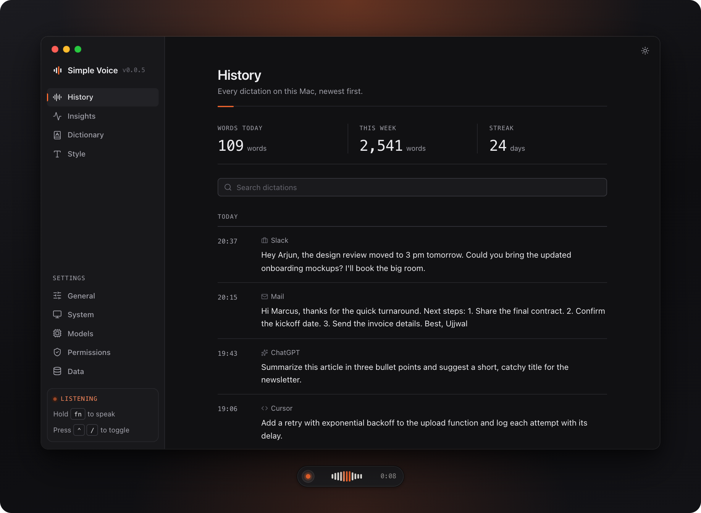
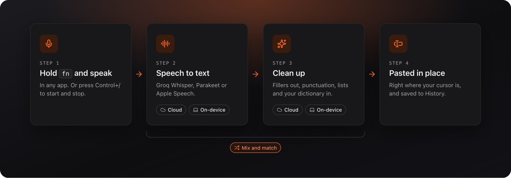
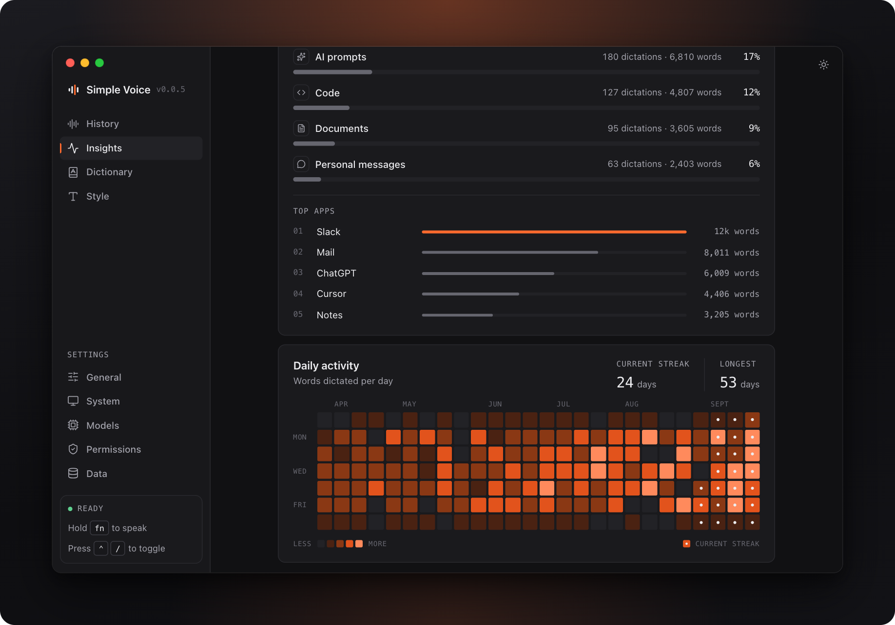
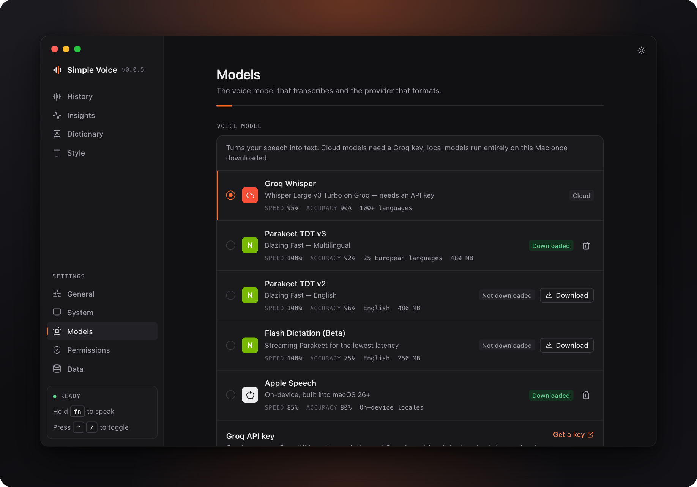
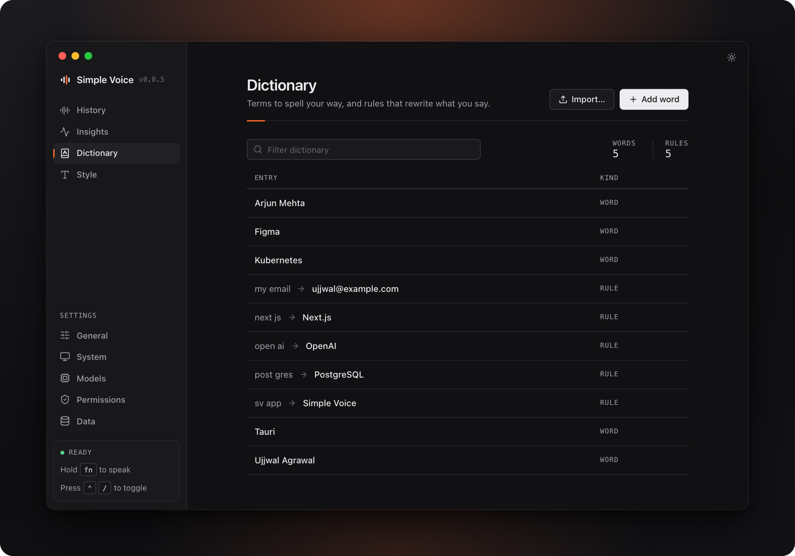
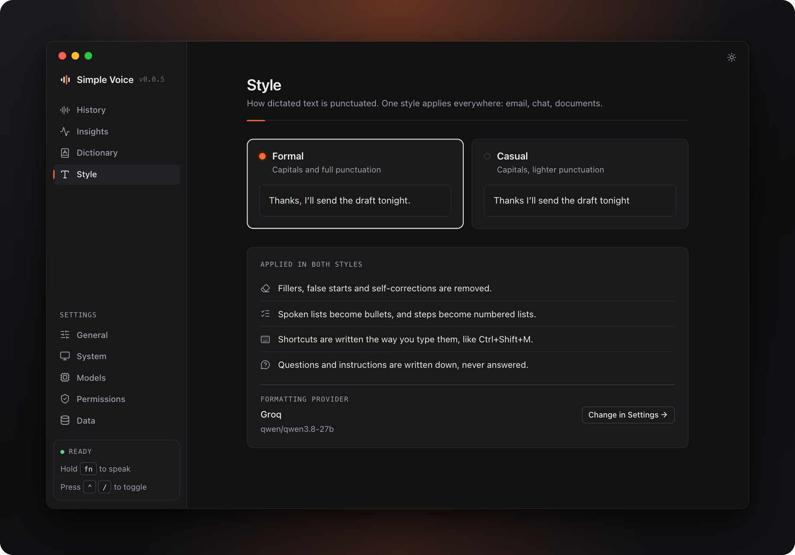

<!-- FilePath: README.md -->

<p align="center">
    
</p>

<h1 align="center">Simple Voice</h1>

<p align="center">
    Speak anywhere on your Mac. Clean, well-formatted text lands in whatever you are typing into.
</p>

<p align="center">
    <a href="https://github.com/yuyudhan/simple-voice/releases/latest"></a>
    <a href="https://github.com/yuyudhan/simple-voice/actions/workflows/ci.yml"></a>
    
    <a href="LICENSE"></a>
</p>

<p align="center">
    <a href="#install">Install</a> · <a href="docs/features.md">Features</a> · <a href="docs/getting-started.md">Getting started</a> · <a href="docs/privacy.md">Privacy</a>
</p>



## Install

Requires an Apple Silicon Mac with macOS 14 (Sonoma) or later.

```sh
curl -fsSL https://github.com/yuyudhan/simple-voice/releases/latest/download/install.sh | bash
```

The script checks the download against the release's SHA-256 checksum and the app's code signature before it replaces `~/Applications/Simple Voice.app`; no administrator password is needed. To install a specific release, use `... | bash -s -- --version X.Y.Z`.

Then open **Simple Voice** from Spotlight or `~/Applications` and grant the permissions it asks for: Microphone and Accessibility, plus Speech Recognition if you use Apple Speech. See [Getting started](docs/getting-started.md).

| Task                          | How                                                                   |
| ----------------------------- | --------------------------------------------------------------------- |
| Upgrade                       | Click **Install update** in the app, or run the install command again |
| Uninstall                     | `rm -rf ~/Applications/"Simple Voice.app"`                            |
| Uninstall and delete all data | The line above, then `rm -rf ~/.simplevoice`                          |

Releases are signed with the project's own certificate, so macOS keeps Simple Voice's permissions across upgrades. Until Apple notarizes them, the install script clears the download quarantine so macOS opens the app.

## Why Simple Voice

- **Works everywhere.** Mail, chat, your editor, a terminal: the text is pasted where your cursor is.
- **Cloud or on-device, your pick.** Groq in the cloud, or Parakeet, Apple Speech and Apple Intelligence on your Mac. Any OpenAI-compatible endpoint, like a local Ollama or LM Studio, works too.
- **Reads like you wrote it.** Fillers and false starts are dropped, lists get laid out, and your dictionary spells names and jargon your way.
- **Yours alone.** No account, no telemetry. History, dictionary and insights stay on your Mac.

| You say                                                      | Simple Voice types                   |
| ------------------------------------------------------------ | ------------------------------------ |
| "um so can you send the report by friday, no wait, thursday" | Can you send the report by Thursday? |
| "press control shift m to mute"                              | Press Ctrl+Shift+M to mute.          |
| "the app reads from post gres"                               | The app reads from PostgreSQL.       |
| "kal ki meeting 5 baje hai na"                               | Kal ki meeting 5 baje hai na?        |

See [all features](docs/features.md).

## How it works



Hold **fn** and speak, let go to paste. Or press **Control+/** to start and stop. Esc cancels. Both shortcuts can be changed in Settings.

|                | Cloud                                   | On-device                                                                                            |
| -------------- | --------------------------------------- | ---------------------------------------------------------------------------------------------------- |
| Speech to text | Groq Whisper (100+ languages)           | Parakeet TDT v3 (25 European languages), Parakeet TDT v2 and Flash Dictation (English), Apple Speech |
| Clean up       | Groq, or any OpenAI-compatible endpoint | Apple Intelligence, or a local Ollama or LM Studio                                                   |
| You need       | A Groq API key                          | A one-time model download (250 to 480 MB); Apple Speech and Apple Intelligence need macOS 26         |

Mix and match: any speech engine works with any clean-up provider, and clean-up can be turned off. If clean-up fails, the plain transcript is pasted, so nothing is lost.

## A look inside

|  |  |
| :-----------------------------------------------------------------------------: | :------------------------------------------------------------------------------: |
|       **Insights.** Speaking speed, words, streaks and where you dictate.       |                **Models.** Pick a cloud or on-device voice model.                |
|  |               |
|           **Dictionary.** Names, jargon and `heard -> written` rules.           |                 **Style.** Formal or Casual, applied everywhere.                 |

## Your data stays yours

Everything lives in `~/.simplevoice` on your Mac: settings, history, dictionary, insights and downloaded models. There is no account and no telemetry. Only what the providers you pick need leaves your Mac: the recording goes to Groq if you use Groq Whisper, and the transcript goes to your clean-up provider, each with your dictionary words as a hint. With an on-device setup, your words never leave your Mac. Read more in [Privacy and your data](docs/privacy.md).

## Build from source

You need macOS 14 or later on Apple Silicon, Xcode 26 or its Command Line Tools (for the macOS 26 SDK), Rust via [rustup](https://rustup.rs), [bun](https://bun.sh), [just](https://just.systems) and sqlx-cli with SQLite support.

```sh
git clone https://github.com/yuyudhan/simple-voice.git
cd simple-voice
just setup     # install dependencies and git hooks
just dev       # run the app
just build     # build the release .app
```

The [development guide](docs/internal/development.md) covers the prerequisites, quality gates and the Swift engine helper.

## Contributing

Issues and pull requests are welcome. Start with the [contributor guide](AGENTS.md) and [docs/internal](docs/internal/), and run `just check` before you push.

## License

[MIT](LICENSE) © 2026 yuyudhan
