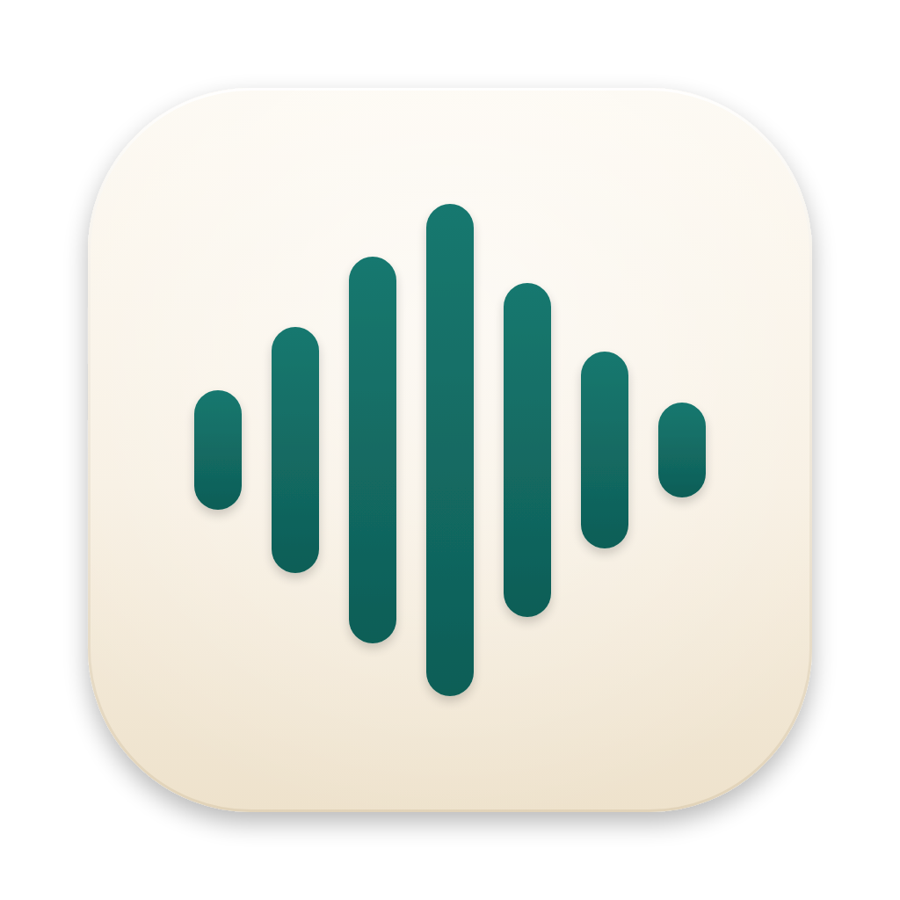

<!-- FilePath: README.md -->

<p align="center">
    
</p>

<h1 align="center">Simple Voice</h1>

<p align="center">
    Speak anywhere on your Mac. Clean, well-formatted text lands in whatever you are typing into.
</p>

Hold a shortcut, talk, let go: your words are transcribed, tidied up and pasted into the focused
app. Use Groq in the cloud or run fully on-device with Parakeet, Apple Speech and Apple
Intelligence.

## Install

Requires an Apple Silicon Mac with macOS 14 (Sonoma) or later, and [Homebrew](https://brew.sh).

```sh
brew install --cask yuyudhan/tap/simple-voice
```

Then open **Simple Voice** from Applications and grant the permissions it asks for
(Microphone and Accessibility). See [Getting started](docs/getting-started.md).

| Task                          | Command                                    |
| ----------------------------- | ------------------------------------------ |
| Upgrade                       | `brew upgrade --cask simple-voice`         |
| Uninstall                     | `brew uninstall --cask simple-voice`       |
| Uninstall and delete all data | `brew uninstall --zap --cask simple-voice` |

Until releases are notarized by Apple, the app is ad-hoc signed and Homebrew clears its download
quarantine so macOS opens it; `brew info --cask simple-voice` shows the caveat.

## Documentation

- [Getting started](docs/getting-started.md): permissions, Groq API key, upgrades.
- [Features](docs/features.md)
- [Privacy and your data](docs/privacy.md)
- Contributing: [development guide](docs/internal/development.md) and the rest of
  [docs/internal](docs/internal/).

## License

[MIT](LICENSE) © 2026 yuyudhan
