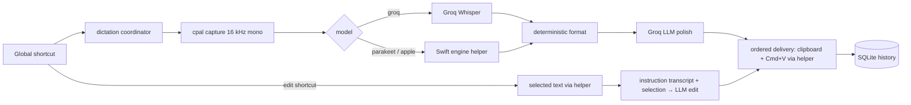

<!-- FilePath: docs/internal/architecture.md -->

# Simple Voice — Architecture

Simple Voice is a Tauri 2 app with three parts:

| Part          | Path         | Language                                         | Owns                                                                                                                                                                               |
| ------------- | ------------ | ------------------------------------------------ | ---------------------------------------------------------------------------------------------------------------------------------------------------------------------------------- |
| Core          | `src-tauri/` | Rust (`#![forbid(unsafe_code)]`)                 | Database, audio capture, dictation pipeline, Groq, shortcuts, windows, tray, sounds                                                                                                |
| Engine helper | `engine/`    | Swift (SwiftPM executable `simple-voice-engine`) | Everything that needs Apple frameworks: Parakeet (FluidAudio, Core ML), Apple Speech (`SpeechAnalyzer`), model downloads, permissions, frontmost app, selected text, synthetic Cmd+V / Cmd+C, output mute, the floating overlay pill |
| UI            | `src/`       | React + TypeScript (Vite)                        | The main window (`index.html`)                                                                                                                                                     |

Rust forbids `unsafe`, so every Objective-C / C API call lives in the Swift helper. The helper is
bundled as a Tauri sidecar (`bundle.externalBin = ["binaries/simple-voice-engine"]`), started
once at app launch, kept resident (so Core ML models stay loaded), and restarted on crash.



Edit mode (requirements ED-1..ED-7) reuses the dictation path: the edit shortcut starts a
recording whose `SessionInput.selection` carries the selection read started at key-down;
`pipeline::run_session` hands such a session to `features/dictation/edit.rs`, which transcribes
the instruction, sends `sv_text::edit_prompt` to the post-processing provider through
`features/dictation/llm.rs` (shared with the formatting pass), checks the reply with
`sv_text::accept_edit`, and pastes it without a trailing separator only while the app the edit
started in is still frontmost.

Learning from corrections (requirements LC-1..LC-6) follows a pasted dictation into its field:
when `Settings.learnFromEdits` is on and post-processing is not off, the coordinator sends the
helper `prepare_edit_watch` at every recording start (ending the previous watch before a new
paste can change the field), and `pipeline::run_session` hands each pasted dictation to
`features/dictation/learning.rs`. That task awaits `watch_edits`, stores a changed text as
`history.edited_text`, reduces it to word substitutions with `sv_text::corrections`, re-reads the
setting, asks the post-processing provider through `llm.rs` with `sv_text::learning_prompt`,
keeps only the offered corrections via `sv_text::accept_learning`, and adds them with
`Db::learn_words`, emitting `dictionary-changed`.

## 1. Storage

- Data directory: `~/.simplevoice/` (created on launch, mode 0700).
    - `update.log` — output of the last in-app update install (file mode 0600), replaced by each.
    - `simple-voice.db` — default database location (file mode 0600).
    - `location` — optional one-line file holding the absolute path of the directory that
      contains the database when the user moved it (Settings → Data). Absent = default. If that
      directory is missing at launch (e.g. an unmounted drive), `Db::open` fails with a message
      instead of creating an empty database there. `Db::open_at(dir)` treats `dir` as both the
      data directory and the database directory.
    - `models/` — downloaded local models (owned by the engine helper, passed as `--models-dir`).
    - `audio/` — WAVs of failed dictations, kept for retry; deleted when the entry is retried
      successfully or deleted.
    - `backups/` — `simple-voice-<timestamp>-v<N>.db` copies taken before migrations (last 3 kept).
- Migrations: `crates/sv-storage/migrations/NNNN_name.sql`, embedded with `sqlx::migrate!` and
  applied on every launch, so a new app version upgrades the user's database in place.
  Forward-only; never edit a shipped migration. Before applying pending migrations to an existing
  database the core copies it into `backups/`. A database newer than the app (downgrade) refuses
  to open with a clear message instead of corrupting data.
- Every query uses sqlx macros (`query!`, `query_as!`, `query_scalar!`); runtime
  `sqlx::query(` strings are banned by `scripts/guard/no-runtime-sql.sh`. The offline cache
  `.sqlx/` at the workspace root is committed and CI builds with `SQLX_OFFLINE=true`.
  `just sqlx-prepare` regenerates it against `target/sqlx-dev.db`
  (`DATABASE_URL=sqlite:target/sqlx-dev.db`, created by `just sqlx-db`).

### Schema (migrations `0001_init.sql` onward; the current shape)

```sql
CREATE TABLE settings (
    key   TEXT PRIMARY KEY NOT NULL,
    value TEXT NOT NULL                -- JSON-encoded value
);
CREATE TABLE dictionary (
    id          INTEGER PRIMARY KEY NOT NULL,
    phrase      TEXT NOT NULL COLLATE NOCASE UNIQUE,  -- word to recognise / text heard
    replacement TEXT,                                 -- NULL = plain word; else written form
    created_at  INTEGER NOT NULL,                     -- unix ms
    source      TEXT NOT NULL DEFAULT 'manual'        -- 'manual' | 'learned' (0006)
);
CREATE TABLE dictionary_rejected (                   -- learned words the user deleted (0006)
    phrase      TEXT PRIMARY KEY NOT NULL COLLATE NOCASE,
    rejected_at INTEGER NOT NULL                      -- unix ms
);
CREATE TABLE history (
    id               INTEGER PRIMARY KEY NOT NULL,
    created_at       INTEGER NOT NULL,   -- unix ms, recording start
    status           TEXT NOT NULL,      -- 'pasted' | 'unformatted' | 'failed' | 'dropped' | 'not_pasted'
    raw_text         TEXT NOT NULL,      -- transcript as returned by the model
    final_text       TEXT NOT NULL,      -- what was pasted (or would have been)
    error            TEXT,               -- failure, paste problem, or why formatting was skipped
    model            TEXT NOT NULL,      -- transcription model id, e.g. 'groq-whisper'
    format_model     TEXT,               -- model id whose formatting pass produced final_text; NULL if none (0003)
    language         TEXT,
    style            TEXT NOT NULL,      -- 'formal' | 'casual'
    audio_ms         INTEGER NOT NULL,
    latency_ms       INTEGER NOT NULL,   -- stop → paste
    transcribe_ms    INTEGER,            -- transcription call duration; NULL if it failed or before 0004
    format_ms        INTEGER,            -- formatting pass duration; set exactly when format_model is (0004)
    source_text      TEXT,               -- edits only: the selection replaced; raw_text = instruction,
                                         -- final_text = edited text, word_count = instruction words (0005)
    word_count       INTEGER NOT NULL,
    dictionary_fixes INTEGER NOT NULL,   -- replacement-rule hits
    words_corrected  INTEGER NOT NULL,   -- word-level edit distance raw → final
    app_name         TEXT,
    bundle_id        TEXT,
    app_category     TEXT NOT NULL,      -- see AppCategory
    audio_path       TEXT,               -- set only while a failed entry can be retried
    edited_text      TEXT                -- the pasted text after the user corrected it in place (0006)
);
CREATE INDEX history_created_at ON history(created_at);
```

## 2. Code organization

### Rust workspace (root `Cargo.toml`)

Split horizontally into crates by responsibility; each crate is split vertically by feature.
Dependencies only point down the table. Every crate: `[lints] workspace = true` and
`#![forbid(unsafe_code)]`.

| Crate                | Path                 | Depends on             | Owns                                                                                                                                                                                                                                                                                                                                                                                                    |
| -------------------- | -------------------- | ---------------------- | ------------------------------------------------------------------------------------------------------------------------------------------------------------------------------------------------------------------------------------------------------------------------------------------------------------------------------------------------------------------------------------------------------- |
| `simple-voice` (app) | `src-tauri/`         | all below              | Tauri wiring. `src/features/<feature>/` vertical slices (`dictation/`, `history/`, `dictionary/`, `insights/`, `settings/`, `models/`, `permissions/`, `updates/`), each holding that feature's commands and logic; `src/platform/` (`shortcuts.rs`, `overlay.rs`, `tray.rs`, `windows.rs`, `engine_process.rs`, `dock.rs`); `src/events.rs` (event names + emit helpers); `src/state.rs`; `src/lib.rs` |
| `sv-storage`         | `crates/sv-storage/` | `sv-domain`            | `paths.rs`, `db.rs` (open, backup, migrate, relocate), `settings.rs`, `history.rs`, `dictionary.rs`, `insights.rs`, `model_insights.rs`, `migrations/`                                                                                                                                                                                                                                                  |
| `sv-text`            | `crates/sv-text/`    | `sv-domain`            | `vocabulary.rs`, `formatting.rs`, `polish.rs` (prompt, guards, timeout), `edit.rs` (edit-mode prompt, checks, timeout), `preview.rs` (the pill's one-line text preview) — pure, no I/O |
| `sv-cloud`           | `crates/sv-cloud/`   | `sv-domain`, `sv-text` | `groq_whisper.rs`, `chat.rs` (one OpenAI-compatible chat completion for Groq and custom endpoints, shared by the formatting pass and edit mode), `releases.rs` (latest GitHub release) |
| `sv-audio`           | `crates/sv-audio/`   | `sv-domain`            | `devices.rs`, `capture.rs` (cpal → 16 kHz mono i16 + level), `wav.rs`, `cues.rs` (4 synthesized themes, rodio)                                                                                                                                                                                                                                                                                          |
| `sv-engine`          | `crates/sv-engine/`  | `sv-domain`            | `client.rs` (request ids, pending map, progress streams), `protocol.rs` (typed commands/results)                                                                                                                                                                                                                                                                                                        |
| `sv-domain`          | `crates/sv-domain/`  | —                      | Shared serde types, `AppError`, `categorize`, `text_stats` (exists; read the source)                                                                                                                                                                                                                                                                                                                    |

### Crate APIs (the contract between slices)

```rust
// ── sv-domain (exists) ─────────────────────────────────────────────────────────────────
// Settings, SettingsPatch, Style, SoundTheme, Theme, PostProcessing, HistoryEntry, NewHistory,
// HistoryStatus, DictionaryEntry, ImportSummary, Insights, DayActivity, HourActivity,
// PersonalBests, CategoryUsage, AppUsage, ModelInsights, ModelTiming,
// AppCategory + categorize(), ModelInfo/Kind/Provider/Status + model id consts, Permissions,
// PermissionKind/Status, DictationState/Phase, ModelProgress, AppError/AppResult,
// text_stats::{word_count, words_corrected}, UpdateStatus + Release (update notices).
// Settings.editShortcut (default "Alt+Slash", "" = edit mode off, never "Fn" or a dictation
// shortcut; a stored default that collides loads as ""). HistoryEntry.sourceText /
// NewHistory.source_text: the selection an edit replaced, None for dictations.
// DictationState.edit (serialized only when true) marks an edit session.
// Theme = System (default) | Light | Dark, wire "system" | "light" | "dark"; Settings.theme and
// SettingsPatch.theme, stored in the `settings` row keyed `theme` like every other field.
// Settings.checkForUpdates (default true) and Settings.skippedUpdate (dismissed release version,
// "" = none) drive the update notice.
// DictionarySort = NameAsc (default) | NameDesc | Newest | Oldest, wire "name_asc" | "name_desc"
// | "newest" | "oldest"; Settings.dictionarySort remembers the Dictionary page order. Newest and
// Oldest order by created_at, then id (an import shares one timestamp).
// DictionarySource = Manual | Learned, wire "manual" | "learned"; DictionaryEntry.source.
// HistoryEntry.editedText: the pasted text as the user corrected it, None when never corrected.
// Settings.learnFromEdits (default false) turns on learning from corrections.

// ── sv-storage ──────────────────────────────────────────────────────────────────────────
pub mod paths {
    pub fn data_dir() -> AppResult<PathBuf>;      // ~/.simplevoice (created, 0700)
    pub fn models_dir() -> AppResult<PathBuf>;    // data_dir/models
    pub fn audio_dir() -> AppResult<PathBuf>;     // data_dir/audio
    pub fn backups_dir() -> AppResult<PathBuf>;   // data_dir/backups
    pub fn database_dir() -> AppResult<PathBuf>;  // contents of data_dir/location, else data_dir
}
#[derive(Clone, Debug)] pub struct Db { .. }       // cheap clone; pool swappable for relocate
impl Db {
    pub async fn open() -> AppResult<Db>;                          // dirs, backup, migrate
    pub async fn open_at(dir: &Path) -> AppResult<Db>;             // tests / relocate
    pub async fn relocate(&self, new_dir: &Path) -> AppResult<()>; // VACUUM INTO, write `location`, reopen, remove old
    pub async fn database_path(&self) -> PathBuf;
    pub async fn settings(&self) -> AppResult<Settings>;            // fills derived fields
    pub async fn update_settings(&self, patch: SettingsPatch) -> AppResult<Settings>; // validates ranges
    pub async fn groq_api_key(&self) -> AppResult<Option<String>>;  // stored, else env GROQ_API_KEY
    pub async fn set_groq_api_key(&self, key: Option<String>) -> AppResult<()>;
    pub async fn custom_api_key(&self) -> AppResult<Option<String>>;
    pub async fn set_custom_api_key(&self, key: Option<String>) -> AppResult<()>;
    pub async fn insert_history(&self, entry: NewHistory) -> AppResult<HistoryEntry>;
    pub async fn update_history(&self, id: i64, entry: NewHistory) -> AppResult<HistoryEntry>;
    pub async fn history_entry(&self, id: i64) -> AppResult<Option<HistoryEntry>>;
    pub async fn history_audio_path(&self, id: i64) -> AppResult<Option<String>>;
    pub async fn list_history(&self, query: Option<String>, limit: i64, before_id: Option<i64>)
        -> AppResult<Vec<HistoryEntry>>;                             // newest first
    pub async fn delete_history(&self, id: i64) -> AppResult<Option<String>>; // audio path to remove
    pub async fn clear_history(&self) -> AppResult<Vec<String>>;              // audio paths
    pub async fn dictionary(&self) -> AppResult<Vec<DictionaryEntry>>;        // phrase order
    pub async fn add_dictionary_entry(&self, phrase: String, replacement: Option<String>)
        -> AppResult<DictionaryEntry>;                               // duplicate → InvalidInput
    pub async fn update_dictionary_entry(&self, id: i64, phrase: String, replacement: Option<String>)
        -> AppResult<DictionaryEntry>;
    pub async fn delete_dictionary_entry(&self, id: i64) -> AppResult<()>;  // learned → rejected
    pub async fn import_vocabulary(&self, text: &str) -> AppResult<ImportSummary>; // bare lines, `a -> b`, `#`
    // Manual adds and imports lift a rejection; updating an entry makes it manual.
    pub async fn learn_words(&self, phrases: &[String]) -> AppResult<Vec<DictionaryEntry>>;
        // inserted rows only: skips existing (case-insensitive), rejected and invalid phrases
    pub async fn set_history_edited_text(&self, id: i64, text: &str) -> AppResult<()>;
    pub async fn insights(&self, now_ms: i64, utc_offset_minutes: i32) -> AppResult<Insights>;
    pub async fn model_insights(&self) -> AppResult<ModelInsights>; // per-model stage timings
}

// ── sv-text ─────────────────────────────────────────────────────────────────────────────
pub struct Rule { pub from: String, pub to: String }
pub struct Vocabulary { pub prompt: String, pub terms: Vec<String>, pub rules: Vec<Rule>, pub omitted: usize }
impl Vocabulary { pub fn from_entries(entries: &[DictionaryEntry]) -> Vocabulary; }  // prompt ≤ 850 chars
impl Default for Vocabulary { .. }                                // empty dictionary
pub const PROMPT_MAX_CHARS: usize = 850;
pub struct Formatted { pub text: String, pub rule_hits: u32 }
pub fn format(text: &str, vocabulary: &Vocabulary, style: Style) -> Formatted;
// Post-processing ("polish"). One prompt, three backends:
//   groq   → Groq chat completions (reasoning_effort "none", temperature 0)   — sv-cloud
//   custom → any OpenAI-compatible /chat/completions (Ollama, LM Studio, ...) — sv-cloud
//   apple  → on-device Apple Intelligence via the engine helper `polish` command — app
pub struct PolishPrompt { pub system: String, pub shots: Vec<(String, String)>, pub user: String }
pub enum PolishTarget { Chat, OnDevice }                          // apple: OnDevice (no Hindi shots, a self-correction shot, framed user turns)
pub fn polish_prompt(text: &str, terms: &[String], style: Style, target: PolishTarget) -> PolishPrompt;
pub fn polish_timeout(text: &str) -> Duration;                    // 2.5 s + 5 ms/word
pub enum PolishOutcome { Polished(String), Skipped(String) }       // reason
pub fn should_skip_polish(text: &str) -> Option<PolishOutcome>;    // Some(Skipped("too short")) < 3 words
pub fn accept_polish(input: &str, output: &str, finished: bool) -> PolishOutcome; // empty / truncated / grew
// Edit mode (edit.rs): the same PolishPrompt shape for every backend; the selection sits between
// <text> tags and is data, the instruction is carried out.
pub const EDIT_MAX_CHARS: usize = 4_000;
pub fn edit_prompt(selection: &str, instruction: &str, terms: &[String]) -> PolishPrompt;
pub fn edit_timeout(selection: &str) -> Duration;                 // 6 s + 20 ms/word, ≤ 30 s
pub fn edit_max_tokens(selection: &str) -> u32;                   // chars + 256, ≤ 4096 (per-minute quotas)
pub fn accept_edit(selection: &str, output: &str, finished: bool) -> Result<String, String>;
    // Err(reason) when truncated or empty; strips echoed <text> tags / code fences; keeps the
    // selection's leading and trailing whitespace
pub fn preview(text: &str) -> String; // one line, list markers dropped, ≤ 80 chars at a word boundary, then "..."
// Learning from corrections (learning.rs): word substitutions between the pasted and the
// corrected text, and the prompt that lets the post-processing model pick the ones to learn.
pub struct Correction { pub before: String, pub after: String, pub context: String }
pub const MAX_CORRECTIONS: usize = 8;
pub const LEARNING_MAX_TOKENS: u32 = 64;
pub const LEARNING_TIMEOUT: Duration = Duration::from_secs(10);
pub fn corrections(pasted: &str, edited: &str) -> Vec<Correction>;
    // substitutions of ≤ 3 words per side; none for punctuation-only changes, pure inserts or
    // deletes, or a rewrite (more than max(4, half the pasted words) changed)
pub fn learning_prompt(corrections: &[Correction]) -> PolishPrompt; // reply: numbers or "none"
pub fn accept_learning(corrections: &[Correction], output: &str, finished: bool) -> Vec<String>;
    // the `after` of each offered number; nothing when unfinished

// ── sv-cloud ────────────────────────────────────────────────────────────────────────────
pub struct Transcript { pub text: String, pub language: Option<String> }
pub async fn groq_transcribe(client: &reqwest::Client, key: &str, wav: Vec<u8>, prompt: &str,
    languages: &[String], fallback_language: &str) -> AppResult<Transcript>;
pub async fn groq_verify_key(client: &reqwest::Client, key: &str) -> AppResult<()>;
pub const GROQ_CHAT_URL: &str = "https://api.groq.com/openai/v1/chat/completions";
pub struct ChatEndpoint<'a> { pub url: String, pub key: Option<&'a str>, pub model: &'a str,
    pub groq_no_reasoning: bool }                                   // adds reasoning_effort "none"
pub fn chat_url(base_url: &str) -> String;                         // trims '/', appends "/chat/completions"
pub struct ChatReply { pub text: String, pub finished: bool }     // finished = finish_reason "stop"
pub async fn chat_completion(client: &reqwest::Client, endpoint: &ChatEndpoint<'_>,
    prompt: &PolishPrompt, max_tokens: u32, limit: Duration)
    -> Result<ChatReply, String>;                                  // Err = short reason; callers judge the reply
pub struct LatestRelease { pub version: semver::Version, pub url: String }
pub fn latest_release_url(repository: &str) -> AppResult<String>; // github.com/o/n → releases/latest API
pub async fn latest_release(client: &reqwest::Client, url: &str, user_agent: &str)
    -> AppResult<LatestRelease>;                                   // tag "v0.3.0" → 0.3.0; 15 s timeout

// ── sv-audio ────────────────────────────────────────────────────────────────────────────
pub struct Microphone { pub id: String, pub name: String, pub is_default: bool, pub is_built_in: bool } // serde camelCase
pub fn list_microphones() -> AppResult<Vec<Microphone>>;
pub struct Recorder { .. }                                          // Debug; Send
impl Recorder {
    // Opens the device (None = built-in preferred, else system default) and starts capturing.
    // `on_level` gets 0..1 values ~30 times per second from a non-audio thread.
    pub fn start(device: Option<&str>, on_level: Box<dyn Fn(f32) + Send + 'static>) -> AppResult<Recorder>;
    pub fn stop(self) -> AppResult<Recording>;
}
pub struct Recording { pub samples: Vec<i16> /* 16 kHz mono */, pub duration_ms: i64 }
pub fn encode_wav(samples: &[i16]) -> Vec<u8>;                       // 16 kHz mono PCM16
pub fn decode_wav(bytes: &[u8]) -> AppResult<Vec<i16>>;              // for retry of kept audio
pub enum Cue { Start, Stop, Error }
pub struct CuePlayer { .. }                                          // Debug; owns rodio output on its own thread
impl CuePlayer {
    pub fn new() -> AppResult<CuePlayer>;
    pub fn play(&self, theme: SoundTheme, cue: Cue, volume: f32);    // never blocks; errors logged
}

// ── sv-engine ───────────────────────────────────────────────────────────────────────────
// The app spawns the sidecar (tauri-plugin-shell needs an AppHandle) and wires the pipes, so this
// crate has no Tauri dependency and is unit-testable with an in-memory transport.
pub trait Transport: Send + Sync + 'static { fn send_line(&self, line: String) -> AppResult<()>; }
#[derive(Clone, Debug)] pub struct EngineClient { .. }
impl EngineClient {
    pub fn new() -> EngineClient;                                    // disconnected
    pub fn connect(&self, transport: Arc<dyn Transport>);            // after (re)spawn
    pub fn on_stdout_line(&self, line: &str);                        // app forwards each stdout line
    pub fn on_terminated(&self);                                     // fails all pending, disconnects
    pub fn set_event_handler(&self, handler: EventHandler);          // id-less events; survives restarts
    pub async fn request<T: DeserializeOwned>(&self, cmd: &str, params: serde_json::Value,
        timeout: Duration) -> AppResult<T>;
    pub async fn request_with_progress<T: DeserializeOwned>(&self, cmd: &str, params: serde_json::Value,
        on_progress: Box<dyn Fn(f32, Option<String>) + Send + Sync>, timeout: Duration) -> AppResult<T>;
}
// protocol.rs: typed async methods on EngineClient (result structs re-exported at the crate root;
// `ProgressCallback` = the boxed progress closure above). `line` passed to `send_line` has no
// trailing newline; `on_stdout_line` trims and ignores blank, non-JSON, and unknown-id lines, and
// hands id-less lines to the event handler as `EngineEvent::FnKey { action: FnKeyAction }`
// (`Press | Release | Tap | Chord`); unknown events are ignored.
//   ping() -> PingResult { version }
//   model_status(model: &str, language: Option<&str>)
//       -> ModelStatusResult { status: ModelStatus, size_bytes: Option<u64>, reason: Option<String> }
//   download_model(model: &str, language: Option<&str>, on_progress: ProgressCallback) -> ()
//   delete_model(model: &str) -> ();  preload(model: &str) -> ()
//   transcribe(model: &str, wav_path: &Path, language: Option<&str>)
//       -> EngineTranscript { text, language: Option<String> }
//   permissions() -> Permissions;  request_permission(kind: PermissionKind) -> Permissions
//   open_settings(kind: PermissionKind) -> ()
//   frontmost_app() -> FrontmostApp { name: Option<String>, bundle_id: Option<String> }
//   paste() -> ()   // "accessibility permission missing" maps to AppError::Permission
//   selected_text() -> Option<String>   // None = nothing selected; same permission mapping
//   prepare_edit_watch() -> ()   // ends the running watch; enables the frontmost app's AX tree
//   watch_edits(text: &str, window: Duration) -> EditWatch { text: Option<String>, reason: Option<String> }
//       // resolves when the watch ends; request timeout = window + 10 s
//   set_output_muted(muted: bool) -> bool   // previous muted state
//   watch_fn_key(enabled: bool) -> bool   // whether the Fn key tap is installed now
//   login_item() -> LoginItemStatus   // Enabled | Disabled | RequiresApproval
//   set_login_item(enabled: bool) -> LoginItemStatus   // status after the change
//   polish(system: &str, shots: &[(String, String)], user: &str) -> PolishReply { text, finished }
// All return AppResult<_>; timeouts: download 2 h, preload 5 min, request_permission 10 min,
// transcribe 120 s, polish 30 s (callers apply their own tighter budget), others 10–30 s.
```

### UI (`src/`)

Vertical slices in `src/features/<feature>/` (`history/`, `insights/`, `dictionary/`, `style/`,
`settings/`, `onboarding/`); shared primitives in `src/ui/`; design tokens in
`src/styles/`; the command/event contract in `src/lib/api.ts`; shell (sidebar, routing) in
`src/app/`.

Shared UI state lives in two React contexts in `src/app/`: `SettingsContext.tsx`
(`useSettings()` → `{ settings, update(patch): Promise<boolean>, refresh() }`, kept current by
`settings-changed`; `update` shows its own error toast and resolves `false`) and
`ShellContext.tsx` (`useShell()` → `{ navigate(page) }`, with
`Page = "home" | "insights" | "dictionary" | "style" | SettingsSection` and
`SettingsSection = "general" | "system" | "models" | "permissions" | "data"`). Each settings
section is a first-class page: the sidebar lists it under a Settings group at the bottom and
`settings/SettingsPage.tsx` renders it in the content area like any other page. Tauri events are
consumed with `useTauriEvent(events.x, handler)` from `src/lib/useTauriEvent.ts`; toasts with
`useToast()` from `src/ui`.

Accessibility access: `settings/permissions/AccessibilityWarning.tsx` has no dismiss control. The
shell pins it (sticky) above every page whenever `permissions.accessibility !== "granted"`, saying
that text is only copied, and that Fn does nothing when `holdShortcut` or `toggleShortcut` is
`"Fn"`. The General settings and the onboarding shortcut step show it inline only while Fn is a
shortcut. The helper gates paste and its Fn event tap on the same grant, so the warning, paste and
the tap agree. `AXIsProcessTrusted()` can stay false inside a running process after the user
grants access, so while it does the helper re-checks in a short-lived copy of itself
(`simple-voice-engine --check-accessibility`, exit status 0 when trusted, reused for 1 s); the
2 s permission poller then emits `permissions-changed` and the warning disappears without a
relaunch.

Appearance: `settings.theme` (`"system" | "light" | "dark"`) is applied by the UI, not the
backend (`src/app/theme.ts`). The main window always carries the resolved theme as
`data-theme="light"|"dark"` on `<html>` (for `system`, resolved from
`prefers-color-scheme` and re-resolved live when macOS changes), and calls
`getCurrentWindow().setTheme(theme)`, or `setTheme(null)` for `system`, so the native title
bar matches. The last choice is cached in `localStorage["sv.theme"]` and painted before React
mounts, so launch never flashes the other theme. The overlay pill (§ 5) keeps its fixed palette.
`src-tauri/capabilities/default.json` grants `core:window:allow-set-theme` for this.

## 3. Tauri commands (invoked from the UI; TypeScript types in `src/lib/api.ts`)

All commands return `Result<T, AppError>`; the UI receives the error message string.

| Command                                                                        | Args                                                | Returns                                                                                                          |
| ------------------------------------------------------------------------------ | --------------------------------------------------- | ---------------------------------------------------------------------------------------------------------------- |
| `get_settings`                                                                 | —                                                   | `Settings`                                                                                                       |
| `update_settings`                                                              | `patch: SettingsPatch`                              | `Settings` (re-registers shortcuts, dock, login item, overlay as needed; invalid shortcut or refused login item → error, nothing saved) |
| `set_groq_api_key`                                                             | `key: string \| null`                               | `Settings`                                                                                                       |
| `verify_groq_api_key`                                                          | `key: string`                                       | `null`                                                                                                           |
| `set_custom_api_key`                                                           | `key: string \| null`                               | `Settings`                                                                                                       |
| `test_post_processing`                                                         | —                                                   | `{ output: string, latencyMs: number }` (formats a fixed sample with the current provider)                       |
| `set_database_dir`                                                             | `dir: string`                                       | `Settings`                                                                                                       |
| `suspend_shortcuts`                                                            | `suspended: boolean`                                | `null` (UI suspends while recording a new shortcut)                                                              |
| `list_microphones`                                                             | —                                                   | `Microphone[]`                                                                                                   |
| `list_history`                                                                 | `query?: string, limit: number, beforeId?: number`  | `HistoryEntry[]`                                                                                                 |
| `delete_history`                                                               | `id`                                                | `null`                                                                                                           |
| `clear_history`                                                                | —                                                   | `null`                                                                                                           |
| `retry_history`                                                                | `id`                                                | `HistoryEntry`                                                                                                   |
| `copy_text`                                                                    | `text`                                              | `null`                                                                                                           |
| `list_dictionary`                                                              | —                                                   | `DictionaryEntry[]`                                                                                              |
| `add_dictionary_entry`                                                         | `phrase, replacement?`                              | `DictionaryEntry`                                                                                                |
| `update_dictionary_entry`                                                      | `id, phrase, replacement?`                          | `DictionaryEntry`                                                                                                |
| `delete_dictionary_entry`                                                      | `id`                                                | `null` (a learned word is recorded as rejected)                                                                  |
| `import_vocabulary`                                                            | `path: string`                                      | `ImportSummary`                                                                                                  |
| `get_insights`                                                                 | —                                                   | `Insights`                                                                                                       |
| `get_model_insights`                                                           | —                                                   | `ModelInsights` (per-model transcription and formatting timings)                                                 |
| `list_models`                                                                  | —                                                   | `ModelInfo[]` (transcription models + `apple-intelligence` post-processing availability)                         |
| `download_model`                                                               | `id`                                                | `null` (progress via events)                                                                                     |
| `delete_model`                                                                 | `id`                                                | `null`                                                                                                           |
| `get_permissions`                                                              | —                                                   | `Permissions`                                                                                                    |
| `request_permission`                                                           | `kind: "microphone" \| "accessibility" \| "speech"` | `Permissions`                                                                                                    |
| `open_permission_settings`                                                     | `kind`                                              | `null`                                                                                                           |
| `preview_sound`                                                                | `theme: string`                                     | `null`                                                                                                           |
| `start_dictation` / `stop_dictation` / `cancel_dictation` / `toggle_dictation` | —                                                   | `null`                                                                                                           |
| `app_info`                                                                     | —                                                   | `AppInfo`                                                                                                        |
| `get_update_status`                                                            | —                                                   | `UpdateStatus` (cached; no network)                                                                              |
| `check_for_updates`                                                            | —                                                   | `UpdateStatus` (checks now; a failure is reported in `error`, not as a command error)                            |
| `install_update`                                                               | —                                                   | `UpdateStatus` with `installing: true` (starts the install script; fails when no update is available)           |

## 4. Events (Rust → UI)

| Event                 | Payload                                                                                                                                           |
| --------------------- | ------------------------------------------------------------------------------------------------------------------------------------------------- |
| `dictation-state`     | `DictationState`                                                                                                                                  |
| `history-changed`     | `null`                                                                                                                                            |
| `dictionary-changed`  | `null` — words were learned from corrections                                                                                                      |
| `settings-changed`    | `Settings`                                                                                                                                        |
| `model-progress`      | `{ id, fraction, status: "downloading" \| "ready" \| "failed", message? }`                                                                        |
| `permissions-changed` | `Permissions`                                                                                                                                     |
| `navigate`            | `"settings" \| "updates"` — sent to `main` by the tray / app menu; the main window shows Settings → General, or Settings → System for `"updates"` |
| `update-status`       | `UpdateStatus` — when a check starts and ends, and when an install starts and ends without quitting the app                                      |

`UpdateStatus`: `{ currentVersion: string, latest: { version: string, url: string } | null, updateAvailable: boolean, checking: boolean, checkedAt: number | null, error: string | null, installing: boolean, installError: string | null }`.

`DictationState`: `{ phase: "idle" | "recording" | "transcribing" | "formatting" | "done" | "error" | "cancelled", sessionId: number, startedAt?: number, message?: string, text?: string, note?: string, edit?: boolean }`. `text` (done only) is `sv_text::preview` of the pasted text. `edit` is present (true) for every state of an edit session; the pill then shows a pen, "EDITING" for `formatting` and "Edited" for `done`.

## 5. Windows

- `main` — 1080×720 (min 860×600), `titleBarStyle: "Overlay"`, hidden title, traffic lights
  inset. Closing hides it; the tray reopens it. The Dock icon shows only while `main` is visible
  (and `Settings.showInDock` is on): hiding `main` switches the app to the Accessory activation
  policy, so with the window closed there is no Dock "Quit" to stop the shortcuts. The app menu
  binds Cmd+Q to "Close to Menu Bar" (hides `main`, like closing) and offers "Quit Simple Voice"
  without a shortcut; the tray's Quit, the Dock's Quit, logout and the update installer still quit
  the app. Starts hidden when `launchAtLogin` is on and the Dock started at most 120 s earlier (a
  login launch: `SMAppService` passes no arguments, so this is the only signal an `unsafe`-free
  core can read). Gaining focus re-reads the login item (see `login_item` below).
- The overlay pill is not a Tauri window: the Swift helper draws it (`engine/.../Overlay.swift`,
  `PillView.swift`) because floating over full-screen apps needs the AppKit
  `fullScreenAuxiliary` collection behaviour, which Tauri does not expose and Rust cannot set
  without `unsafe`. It is a 580×56 borderless, non-activating `NSPanel` at status-bar level,
  joining all Spaces, click-through, never key, untitled (tiling window managers such as
  AeroSpace treat it as a popup). The helper is an accessory app, so ordering the pill in or out
  never activates Simple Voice or takes focus from the dictation target. The pill is 188 pt wide
  (200 while transcribing or formatting, so the one-line label fits; 104 idle); after a paste it
  shows the preview text and hugs it (188–560 pt), with an amber
  instead of a green check when the text went out unformatted. `platform/overlay.rs` decides
  what it shows and when: visible while a session is active (or always when `showBarAlways`),
  hidden 4 s after `done` and 1.2 s after `error` / `cancelled`,
  placed bottom-centre of the visible frame of the screen under the cursor, 80 pt up. It fades
  in and out over 0.15 s. It replays the last state and visibility to a restarted helper.

## 6. Engine helper protocol (`engine/`)

Launch: `simple-voice-engine --models-dir <path>`. One JSON object per line on stdin; one per
line on stdout. Logs go to stderr only.

Request: `{"id": 7, "cmd": "<name>", ...params}`
Result: `{"id": 7, "ok": true, "result": {...}}` or `{"id": 7, "ok": false, "error": "message"}`
Progress (zero or more before the result): `{"id": 7, "event": "progress", "fraction": 0.42, "message": "..."}`
Fn key (unsolicited, no id, only while `watch_fn_key` is enabled): `{"event": "fn_key", "action": A}`;
A = `"press"` (Fn held 100 ms with nothing else pressed), `"release"` (up after `press`), `"tap"`
(up before `press`), `"chord"` (another key or modifier joined after `press`, e.g. Fn+Arrow; no
`release` follows). Fn pressed while another modifier is held, or joined by a key within 100 ms,
produces nothing.

| cmd                  | Params                                                   | Result                                                                                                                                                       |
| -------------------- | -------------------------------------------------------- | ------------------------------------------------------------------------------------------------------------------------------------------------------------ |
| `ping`               | —                                                        | `{"version": "x.y.z"}`                                                                                                                                       |
| `model_status`       | `model`, `language`?                                     | `{"status": "ready" \| "not_downloaded" \| "unsupported", "sizeBytes"?: n, "reason"?: s}`                                                                    |
| `download_model`     | `model`, `language`?                                     | `{"status": "ready"}` after progress events                                                                                                                  |
| `delete_model`       | `model`                                                  | `{}`                                                                                                                                                         |
| `preload`            | `model`                                                  | `{}` (loads into memory so the first dictation is fast)                                                                                                      |
| `transcribe`         | `model`, `wavPath` (16 kHz mono 16-bit PCM), `language`? | `{"text": s, "language"?: s}`                                                                                                                                |
| `permissions`        | —                                                        | `{"microphone": P, "accessibility": P, "speech": P}`; P = `"granted" \| "denied" \| "not_determined" \| "restricted"` (accessibility is only granted/denied) |
| `request_permission` | `kind`                                                   | same as `permissions`                                                                                                                                        |
| `open_settings`      | `kind`                                                   | `{}` (opens the matching Privacy & Security pane)                                                                                                            |
| `frontmost_app`      | —                                                        | `{"name": s?, "bundleId": s?}`                                                                                                                               |
| `paste`              | —                                                        | `{}` (posts Cmd+V; error `"accessibility permission missing"` when not trusted)                                                                              |
| `selected_text`      | —                                                        | `{"text": s?}`, absent when nothing is selected. Accessibility (`kAXSelectedTextAttribute`; a zero-length `kAXSelectedTextRangeAttribute` means nothing selected), else a synthetic Cmd+C whose pasteboard change is read and the previous pasteboard items restored. Error `"accessibility permission missing"` when not trusted |
| `prepare_edit_watch` | —                                                        | `{}`: ends the running correction watch, then enables the frontmost app's accessibility tree once per process: `AXManualAccessibility` (Electron), else `AXEnhancedUserInterface` only when the bundle has a Chromium `* Helper (Renderer).app`. Error `"accessibility permission missing"` when not trusted |
| `watch_edits`        | `text`, `timeoutMs`                                      | `{"text"?: s, "reason"?: s}` when the watch ends: `text` is the pasted span as it reads then (see [engine.md](engine.md#correction-watch)); `reason` says why nothing was read (secure field, text not exposed, pasted text not found). Same trust error |
| `set_output_muted`   | `muted: bool`                                            | `{"previous": bool}`                                                                                                                                         |
| `polish`             | `system`, `shots: [{user, assistant}]`, `user`           | `{"text": s, "finished": bool}` via Apple Foundation Models (`LanguageModelSession`, temperature 0)                                                          |
| `watch_fn_key`       | `enabled: bool`                                          | `{"active": bool}`: whether the listen-only event tap is installed; without Accessibility access it retries every 2 s while enabled                          |
| `login_item`         | —                                                        | `{"status": "enabled" \| "disabled" \| "requires_approval"}` for `SMAppService.mainApp`; error outside an `.app` bundle (development builds)                   |
| `set_login_item`     | `enabled: bool`                                          | same as `login_item`, after registering or unregistering; `requires_approval` after enabling also opens System Settings → Login Items                        |

Notification (app → helper, no id, never answered, applied on the main thread in the order sent):
`{"cmd": "<name>", ...params}`. They drive the overlay pill:

| cmd               | Params                                                                                   |
| ----------------- | ---------------------------------------------------------------------------------------- |
| `overlay_state`   | `state: DictationState` (§ 4); done, error and cancelled settle back to idle after 4.15 s, 2 s and 0.35 s |
| `overlay_visible` | `visible: bool`; `true` (re)places the pill under the cursor and orders it in             |
| `overlay_level`   | `level: number` 0..1 (RMS), ~30 Hz while recording                                        |

Model ids: `parakeet-tdt-v3`, `parakeet-tdt-v2`, `parakeet-flash`, `apple-speech` (transcription);
`apple-intelligence` (post-processing; `model_status` reports availability, never downloads).
`groq-whisper` is cloud-only and never reaches the helper.
`language` (optional everywhere) is a language code such as `en` or `hi`, or a full locale such as
`en-GB`; only `apple-speech` uses it for `model_status` / `download_model` (its assets are per
locale; default `en-US`). Parakeet files live in `<models-dir>/<model-id>/`, downloaded into
`<model-id>.partial/` and renamed into place when complete.

Launch at login: `settings.launchAtLogin` mirrors `login_item`. `update_settings` changes the
login item before saving and stores nothing when macOS refuses; the core re-reads the status
when the helper connects and whenever the main window gains focus, and stores what macOS reports,
so removing the app under Open at Login switches the setting off. Versions before this used a
`~/Library/LaunchAgents/Simple Voice.plist` agent; the first status read deletes it and, when the
setting was on, registers the login item in its place.

## 7. Transcription × post-processing

Any transcription model combines with any post-processing provider:

|                                 | Groq LLM | Apple Intelligence (on-device) | Custom OpenAI-compatible (Ollama local or any remote) | Off             |
| ------------------------------- | -------- | ------------------------------ | ----------------------------------------------------- | --------------- |
| Groq Whisper (cloud)            | default  | ✓                              | ✓                                                     | ✓               |
| Parakeet / Apple Speech (local) | ✓        | ✓ fully offline                | ✓                                                     | ✓ fully offline |

The Groq API key is entered in Settings → Models, next to the Groq Whisper model and the Groq
post-processing provider; one key serves both.

## 8. Update notices

The install script (`scripts/install.sh`, P-5) installs every version. The `updates` slice asks
GitHub's `releases/latest` endpoint (drafts and pre-releases excluded, the same source the
install script follows) for the repository in the workspace `repository` field, 30 s
after launch and then whenever 24 hours of wall-clock time have passed since the last successful
check (it wakes hourly, since monotonic sleeps stop while the Mac sleeps). A failed check is
retried on the next wake. `Settings.checkForUpdates = false` stops the automatic checks; "Check
now", the tray item and the app-menu item still check on demand. When the release is newer than
the running version (semver), the tray item reads "Update Available: X…", and the UI shows a
banner above every page (hidden for `Settings.skippedUpdate`) and a row in Settings → System,
both with an Install update button.

`install_update` runs `curl -fsSL <repo>/releases/latest/download/install.sh | bash` in its own
process group with stdin closed and stdout and stderr in `~/.simplevoice/update.log`, so the
script survives the app quitting under it. The script downloads the release zip, verifies its
checksum and code signature, quits the app, replaces `~/Applications/Simple Voice.app` and reopens
it; it never needs an administrator password, removes a copy an older script left in
`/Applications` when the user may delete it, and reopens the old app when it fails after quitting
it. If the script exits while the app still runs, the slice clears `installing` and, on
failure, sets `installError` to the script's last `simple-voice:` line (else the last output
line) plus the log path.
